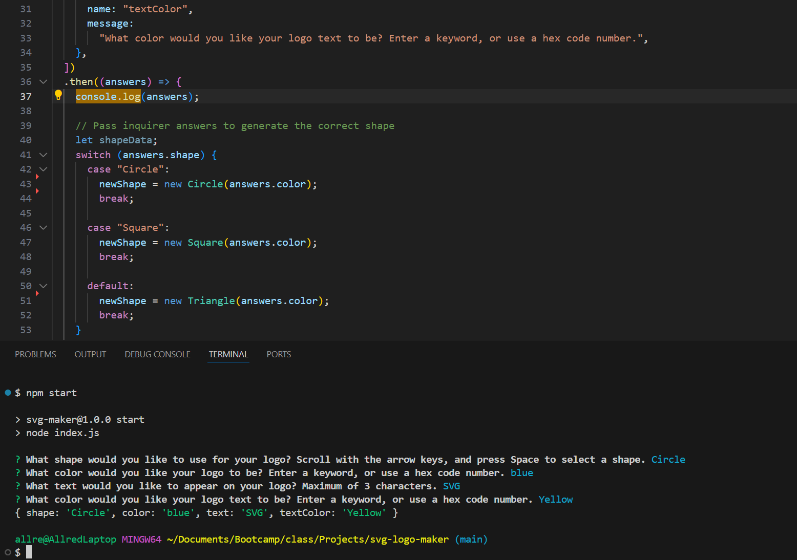
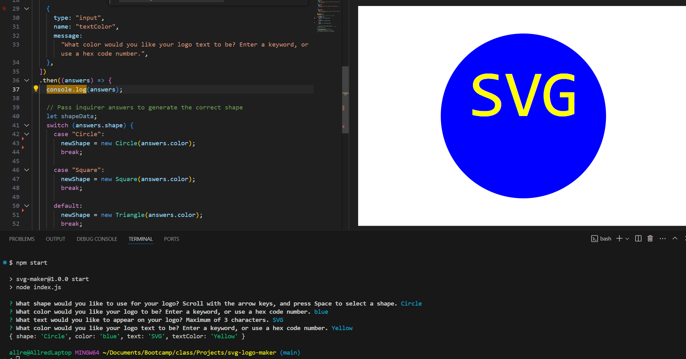

<div align="center">

  <!-- Add badges using the following format: -->
  <!-- (urlToGithubHere) -->

[](https://opensource.org/licenses/MIT)
[](https://github.com/AllredW/svg-logo-maker/graphs/contributors)
[](https://github.com/AllredW/svg-logo-maker/issues)
[](https://linkedin.com/in/in/william-allred-6a2a522b3/)

</div>

  <h3 align="center">SVG Logo Generator</h3>

  <p align="center">
 <br />
    <a href="https://github.com/AllredW/svg-logo-maker"><strong>Explore the docs »</strong></a>
    <br />
    <br />
    <!-- TODO- add deployed link -->
    ·
    <a href="https://github.com/AllredW/svg-logo-maker/issues">Report Bug</a>
    ·
    <a href="https://github.com/AllredW/svg-logo-maker/issues">Request Feature</a>

  </p>
</div>

<!-- TABLE OF CONTENTS -->
<details>
  <summary>Table of Contents</summary>
  <ol>
    <li>
      <a href="#about-the-project">About The Project</a>
      <ul>
        <li><a href="#built-with">Built With</a></li>
      </ul>
    </li>
    <li>
      <a href="#getting-started">Getting Started</a>
      <ul>
        <li><a href="#installation">Installation</a></li>
      </ul>
    </li>
    <li><a href="#usage">Usage</a></li>
    <li><a href="#roadmap">Roadmap</a></li>
    <li><a href="#contributing">Contributing</a></li>
    <li><a href="#license">License</a></li>
    <li><a href="#contact">Contact</a></li>
    <li><a href="#acknowledgments">Acknowledgments</a></li>
  </ol>
</details>

<!-- ABOUT THE PROJECT -->

## About The Project

   This application generates an SVG logo through Node.js. The text, text color, logo shape, and body color of the logo are all responsive to user input through the Inquirer NPM module. The application then uses the input recieved to generate a logo for the user to view and copy the code into a separate Markdown document.
   
### Built With

<div align="center">

[](https://javascript.info/)


</div>

### Local Installation / Usage

1. Clone the rep

```
git clone https://github.com/AllredW/svg-logo-maker.git
```

2. Open your IDE's terminal and run the following command to begin the function:

```
npm start
```

3. The function will produce a series of prompts in the terminal, asking about aspects of your logo. Fill these out, as you would like them presented in the final SVG image.

4. Once the function is completed, your README will be generated in the "examples" folder with the name "Logo.svg". You can view your svg by right clicking this document, and selecting "Open Preview". You can also copy the file out of VC Code and save on your personal computer, make changes to the file using Markdown, etc.

<!-- USAGE EXAMPLES -->

## Usage

</img>

</img>

A link to the demonstration video can also be viewed here: https://www.youtube.com/watch?v=wI22cqFMVZU

<!-- CONTRIBUTING -->

## Contributing

Contributions are what make the open source community such an amazing place to learn, inspire, and create. Any contributions you make are **greatly appreciated**.

If you have a suggestion that would make this better, please fork the repo and create a pull request. You can also simply open an issue with the tag "enhancement".
Don't forget to give the project a star! Thanks again!

1. Fork the Project
2. Create your Feature Branch (git checkout -b feature/AmazingFeature)
3. Commit your Changes (git commit -m 'Add some AmazingFeature')
4. Push to the Branch (git push origin feature/AmazingFeature)
5. Open a Pull Request

<!-- LICENSE -->

## License

This project is licensed under the MIT license.

See LICENSE.txt for more information.

<!-- CONTACT -->

## Contact

[William Allred](https://github.com/AllredW) - allrewil@gmail.com

[Github Repository](https://github.com/AllredW/svg-logo-maker)